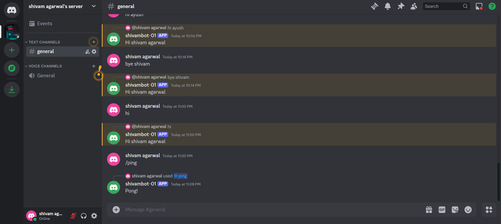

# Discord Bot Project

This is a basic Discord bot project built using `discord.js` and `Node.js`. The bot responds to messages and interactions within a Discord server.

## Features

- Responds to messages with predefined responses
- Handles basic user interactions

## Requirements

- Node.js (v14 or later)
- npm (Node Package Manager)
- Discord account and server
- Discord Bot Token

## Example Commands

- **!ping**: The bot will respond with "Pong!"
- **!hello**: The bot will respond with "Hello, User_Name!"

## Screenshot

